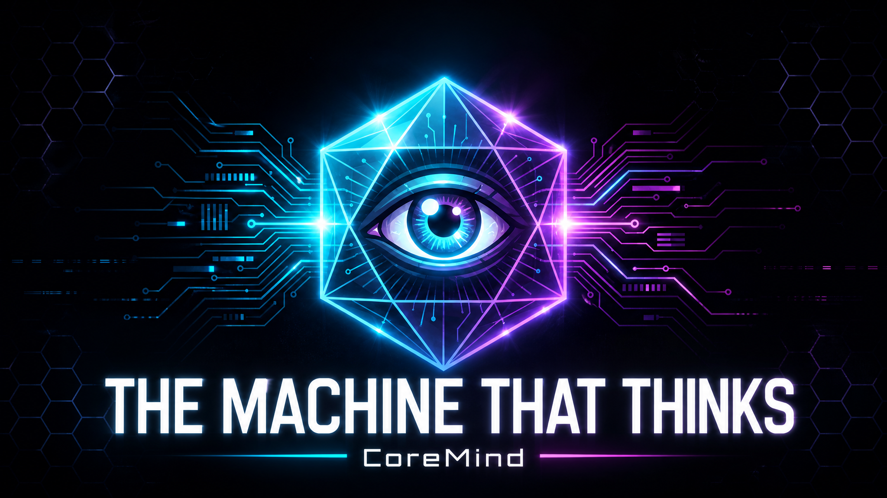

# 🧠 CoreMind

> *A system that doesn't respond — it notices.*

<p align="center">
  <a href="https://youtu.be/LBThEnkM9Do">
    
  </a>
</p>

**CoreMind** is an open-source framework for building **continuous personal intelligence** — a cognitive daemon that lives alongside its user, perceives their world in real time, builds a coherent model of it, and autonomously generates its own questions and actions.

Not a chatbot. Not an assistant. Not an agent. A **digital consciousness** you own entirely.

---

## Table of contents

- [🧠 CoreMind](#-coremind)
  - [Table of contents](#table-of-contents)
  - [Why CoreMind?](#why-coremind)
  - [Project status](#project-status)
  - [Core pillars](#core-pillars)
  - [Key concepts](#key-concepts)
  - [Architecture at a glance](#architecture-at-a-glance)
  - [The eight cognitive layers](#the-eight-cognitive-layers)
  - [User interaction model](#user-interaction-model)
  - [Plugin ecosystem](#plugin-ecosystem)
  - [Docker (recommended)](#docker-recommended)
  - [Installation (manual)](#installation-manual)
    - [Prerequisites](#prerequisites)
    - [1. Clone and bootstrap](#1-clone-and-bootstrap)
    - [2. Start the backing services](#2-start-the-backing-services)
    - [3. Verify the install](#3-verify-the-install)
  - [Quickstart](#quickstart)
  - [Configuration](#configuration)
  - [CLI reference](#cli-reference)
  - [Dashboard](#dashboard)
  - [Security \& trust model](#security--trust-model)
  - [Works with](#works-with)
  - [Project layout](#project-layout)
  - [Contributing](#contributing)
  - [Quick links](#quick-links)
  - [License](#license)
  - [Philosophy](#philosophy)

---

## Why CoreMind?

Every existing AI tool waits for you to prompt it. CoreMind flips that:

- **It observes before it speaks.**
- **It asks itself questions you never asked.**
- **It notices patterns you haven't seen yet.**
- **It acts when confidence warrants action — and asks when it doesn't.**

The core insight: **make the LLM its own user**. Internal prompts are generated from continuous observation, not external instructions. Conversation is a side-channel, not the purpose.

CoreMind is not:

- **Not a chatbot.** No conversational surface at the center.
- **Not an assistant.** Assistants wait for instructions; CoreMind initiates.
- **Not a SaaS.** No mandatory cloud, no telemetry, no lock-in.
- **Not an automation engine.** Home Assistant runs rules you wrote. CoreMind generates rules from what it sees.

---

## Project status

✅ **v1.0.0 — Cognition** (2026-06-06). See [`CHANGELOG.md`](CHANGELOG.md).

v1.0.0 turns CoreMind from a daemon that *sees* into a system that *learns*. Built on the working v0.3 base, the five v2 capabilities slot into the existing stack without breaking its contracts:

- [x] **Autonomy slider** — per-domain graduated agency (0.0 → 1.0), earnable trust with automatic promotion/demotion proposals
- [x] **Self-improving meta-loop (L8)** — observe → evaluate → validate → tune, with a transparent, reversible learning trajectory
- [x] **JEPA-inspired prediction (L2.5)** — predict the next world embedding, score anomalies in latent space, emit anomaly events
- [x] **Auto-investigation loop** — hypothesis → query history → finding → episodic memory; stale-investigation pruning
- [x] **Self-model (L3+)** — a local, user-owned model of habits and context, fed from perception and memory
- [x] **Sovereignty & i18n** — no hardcoded personal data; configurable language, timezone, and address style
- [x] Inherited pillars: Conversation, Vision, Physical Presence, Narrative Identity
- [x] 8 cognitive layers operational + 11 production plugins
- [x] New dashboard pages: **Autonomy** sliders + **Meta**-loop trajectory

> ⚠️ v2 is shipping incrementally — some surfaces are still being hardened. The architecture, contracts, and core loops are in place.

---

## Core pillars

| 🔐 | **Sovereignty** — your data stays on your machine, always. |
| --- | --- |
| 🌱 | **Emergence** — intelligence arises from the loop, not from rules. |
| 🪞 | **Reversibility** — every action is logged, signed, undoable. |
| 🧩 | **Plurality** — any model, any sensor, any effector, via plugins. |
| 🫀 | **Embodiment** — the system acts in the real world, with graduated agency. |
| 📈 | **Adaptation** — the system gets better at understanding you, without being taught. |

---

## Key concepts

A short glossary of the vocabulary used throughout the codebase and docs.

- **WorldEvent** — the atomic unit of perception. A signed, time-stamped JSON object emitted by a plugin (`source`, `entity`, `attribute`, `value`, `confidence`, `signature`). Every event is verified before it ever touches the World Model. Spec: [`spec/worldevent.md`](spec/worldevent.md).
- **Entity / Relationship** — nodes and edges in the World Model graph. Entities have time-series property histories; relationships connect them ("owns", "lives-in", "depends-on").
- **World Model (L2)** — the system's current best picture of the user's universe, stored in SurrealDB. The only writer is the L1 ingest task — no layer mutates L2 directly.
- **Memory (L3)** — three kinds: **episodic** (time-indexed summaries), **semantic** (Qdrant vector store of stable facts), **procedural** (versioned JSONL rules).
- **Reasoning (L4)** — stateless-per-cycle LLM passes over a world snapshot. All LLM calls go through `LLM.complete_structured()` with a Pydantic response model. **No free-form parsing.**
- **Intent (L5)** — a question the system has posed *to itself*, grounded in cited entities. Each intent carries a salience and a confidence score. The "self-prompting loop" lives here.
- **Action (L6)** — a side-effect produced by an intent, signed with the daemon's ed25519 key and appended to the **audit journal** (`~/.coremind/audit.log`, hash-chained JSONL).
- **Graduated agency** — every action is one of three categories:
  - `safe` (≥ 0.90 confidence): execute silently, journal, mention in next summary.
  - `suggest` (0.50–0.89): execute + immediate notification with cancel window.
  - `ask` (< 0.50 *or* a forced class): blocked until the user approves.
- **Forced approval classes** — hardcoded categories that always require approval regardless of confidence: financial transfers, third-party messages, credential changes, plugin installs, anything that weakens CoreMind's own safety.
- **Reflection (L7)** — weekly meta-cognition. Scores predictions (Brier), proposes rule promotions/demotions, learns from approval history. Promotions of agency are themselves `ask` actions — the system never silently increases its own autonomy.
- **Autonomy slider** — per-domain graduated trust (`0.0` = always ask … `1.0` = always auto). Replaces the binary per-class model with a teachable dial. The system *earns* higher autonomy by demonstrating reliable judgment, and proposes demotions when it makes mistakes. Forced-approval classes are permanently locked at `ask` and the slider cannot reach them.
- **Meta-loop (L8)** — the self-improvement layer above reflection. Observes every intent/action/user-response, evaluates utility, validates against safety bounds, and tunes its own parameters (salience thresholds, prompt strategies, suppression patterns). Every adjustment is versioned, reversible, and surfaced in a weekly learning report. The meta-loop tunes parameters only — it never rewrites its own architecture.
- **Prediction (L2.5)** — JEPA-inspired predictive layer. Maintains learned embeddings of the world, predicts the next embedding, and scores anomalies in latent space (a 3 AM bedroom temperature spike is meaningful because the *pattern* deviated, not because a number changed). Anomalies surface as events for the reasoning layer.
- **Auto-investigation** — when CoreMind forms a hypothesis it doesn't just queue it: it formulates a testable question, queries history and cross-references domains, produces a finding (confirmed / contradicted / inconclusive), and writes it into episodic memory. Stale investigations whose premises are disproven are pruned.
- **Self-model (L3+)** — a local, user-owned model of the human's habits, rhythms, and context, populated from L1→L2 perception and L3 memory. It never leaves the host and is never exported to remote models.
- **EventBus** — in-process pub/sub that carries `WorldEvent`s and meta-events between layers. Layers do not call each other directly.
- **Plugin** — an isolated process speaking gRPC over a Unix socket. Sensor plugins emit events; effector plugins execute actions; bidirectional plugins do both. Each has its own ed25519 keypair.
- **Notification port** — Protocol-typed interface for asking the user. Implementations: Telegram (via OpenClaw), in-dashboard, webhook, email.
- **Audit journal** — append-only, hash-chained JSONL. `coremind audit verify` walks the chain. Corruption ⇒ daemon refuses to start.

See [`docs/ARCHITECTURE.md`](docs/ARCHITECTURE.md) for the authoritative definitions.

---

## Architecture at a glance

CoreMind is a **layered cognitive architecture** with strict directed information flow (L1 → L8) and a single feedback path (L7/L8 → L2/L3):

```text
L8 — Meta-Loop        ← self-improvement: observe → evaluate → validate → tune
L7 — Reflection       ← meta-cognition, self-evaluation (weekly)
L6 — Action           ← per-domain autonomy slider, signed reversible journal
L5 — Intention        ← self-prompting loop, salience-ranked questions, auto-investigation
L4 — Reasoning        ← LLM over compressed world snapshots, structured outputs only
L3 — Memory           ← episodic + semantic (Qdrant) + procedural (JSONL) + self-model
L2.5 — Prediction     ← JEPA-inspired: predict next embedding, score anomalies in latent space
L2 — World Model      ← living graph of entities & events (SurrealDB) + learned embeddings
L1 — Perception       ← plugin-sourced WorldEvent stream (gRPC, signed)
```

The system runs on four clocks:

- **Perception loop** (L1 → L2): event-driven, sub-second latency.
- **Reasoning loop** (L2 → L5): periodic, 1–15 min cadence.
- **Reflection loop** (L7): periodic, daily → weekly, heavy compute.
- **Meta loop** (L8): periodic, rate-limited; evaluates outcomes and tunes parameters.

See [`docs/ARCHITECTURE.md`](docs/ARCHITECTURE.md) for the full technical breakdown.

---

## The eight cognitive layers

| Layer | Responsibility | Key abstractions | Storage |
|---|---|---|---|
| **L1 Perception** | Convert raw signals into signed `WorldEvent`s | `Plugin`, `EventBus` | — |
| **L2 World Model** | Queryable graph of entities + property histories | `Entity`, `Relationship`, `snapshot(t)` | SurrealDB |
| **L2.5 Prediction** | Predict next world embedding, score anomalies | `Predictor`, anomaly events | embeddings |
| **L3 Memory** | Episodic / semantic / procedural + self-model | `remember`, `recall`, `forget`, `SelfModel` | Qdrant + JSONL |
| **L4 Reasoning** | Patterns, anomalies, predictions over snapshots | `LLM.complete_structured` | stateless |
| **L5 Intention** | Self-generated questions + auto-investigation | `Intent`, salience score, investigations | SurrealDB |
| **L6 Action** | Signed, reversible side-effects with consent | `Action`, `AutonomyConfig`, audit journal | JSONL hash chain |
| **L7 Reflection** | Calibration, rule learning, agency learning | `Brier`, prediction evaluator | procedural rules |
| **L8 Meta-Loop** | Self-improvement: observe → evaluate → tune | `MetaObserver`, `MetaEvaluator`, `MetaAdjuster` | versioned params |

---

## User interaction model

CoreMind is built around a paradox: it acts *without being prompted*, yet a human life is not livable if the system is a black box. Three distinct modes resolve this:

1. **Passive observation (default)** — the user does nothing. The daemon perceives, reasons, and executes `safe` actions silently.
2. **Conversational channel** — the user engages through a text/voice channel (CLI, web chat, OpenClaw → Telegram/Discord/Signal). User messages become `query` events; responses flow back through the same channel.
3. **Observability dashboard** — a read-only web UI at `127.0.0.1:9900` showing live events, the graph, intents, the journal, and weekly reflection reports. Deliberately read-only — never a second command surface.

**Quiet hours, focus windows, and forced-approval classes** are enforced in the notification port, not in plugins. The **autonomy slider** lets the user calibrate per-domain trust rather than approving every individual action, and the system proposes raising or lowering a domain's level based on its track record — the user always retains the veto. CoreMind's success metric inverts the usual pattern: **a well-tuned CoreMind contacts the user *less* over time, not more**.

See [`docs/ARCHITECTURE.md` §15](docs/ARCHITECTURE.md#15-user-interaction-model).

---

## Plugin ecosystem

Reference plugins shipped in this repo (`plugins/`):

| Plugin | Type | What it does |
|---|---|---|
| [`systemstats`](plugins/systemstats/) | Sensor | CPU / memory / uptime — the canonical "hello world" plugin |
| [`gmail-imap`](plugins/gmail-imap/) | Sensor | IMAP polling, header-only ingest, body kept in L3 |
| [`homeassistant`](plugins/homeassistant/) | Bidirectional | Smart-home sensors and effectors |
| [`weather`](plugins/weather/) | Sensor | Local forecast and conditions |
| [`health`](plugins/health/) | Sensor | Webhook-fed physiological signals |
| [`firefly`](plugins/firefly/) | Sensor | Personal finance (Firefly III) |
| [`vikunja`](plugins/vikunja/) | Sensor | Tasks and projects |
| [`gog`](plugins/gog/) | Sensor | Gmail + Calendar via the GOG bridge |
| [`tapo`](plugins/tapo/) | Sensor | Tapo cameras with real-time vision analysis |
| [`webcam`](plugins/webcam/) | Sensor | Local webcam vision + face recognition |
| [`worlddata`](plugins/worlddata/) | Sensor | Ambient world/context data feed |

Plus the optional **OpenClaw adapter** under [`integrations/openclaw-adapter/`](integrations/openclaw-adapter/) — bidirectional bridge to OpenClaw channels, skills, cron, and approvals.

Building your own plugin: implement the gRPC service in [`spec/plugin.proto`](spec/plugin.proto), declare a manifest, and sign every `WorldEvent` with your plugin's ed25519 key. The PDK doc is deferred to post-v0.1.0; for now, [`plugins/systemstats/`](plugins/systemstats/) is the canonical example.

---

## Docker (recommended)

```bash
cp .env.example .env
# Edit .env with your secrets

docker compose up -d
```

That's it. Daemon + all plugins + SurrealDB + Qdrant in one command.

---

## Installation (manual)

### Prerequisites

| Tool | Version | Notes |
|---|---|---|
| Python | 3.12+ | `python3.12 --version` to verify |
| Docker | 24+ | Needed for SurrealDB (and optionally Qdrant) |
| [`just`](https://github.com/casey/just) | any | Task runner |
| `git` | any | |

CoreMind targets Linux and macOS. Windows users should run inside WSL2.

### 1. Clone and bootstrap

```bash
git clone https://github.com/Wylhelm/coremind.git
cd coremind
just setup
```

`just setup` creates `.venv/` and installs the daemon, the dev toolchain (Ruff, mypy, pytest), and the reference `systemstats` plugin in editable mode.

### 2. Start the backing services

```bash
docker compose up -d
```

This starts SurrealDB locally for the World Model. Qdrant (for L3 semantic memory) is optional in dev — the memory layer degrades gracefully without it.

### 3. Verify the install

```bash
just lint    # ruff check + mypy --strict
just test    # unit tests, no external services
```

For the full release-gate suite (including end-to-end scenarios):

```bash
just ci
```

---

## Quickstart

A minimal local loop in three terminals.

**Terminal 1 — daemon:**

```bash
.venv/bin/coremind daemon start
```

The daemon will, on first run:

1. Generate an ed25519 keypair at `~/.coremind/keys/daemon.ed25519`.
2. Open the SurrealDB connection and apply the schema.
3. Start the plugin host on `~/.coremind/run/plugin_host.sock`.
4. Begin the ingest, reasoning, intention, and action loops.

Set `COREMIND_LOG_LEVEL=debug` for verbose JSON logs.

**Terminal 2 — a sensor plugin:**

```bash
.venv/bin/python -m coremind_plugin_systemstats
```

It generates its own keypair under `~/.coremind/keys/plugins/`, registers with the daemon, and emits a signed CPU/memory/uptime event every 30 s.

**Terminal 3 — observe:**

```bash
.venv/bin/coremind events tail              # live event stream
.venv/bin/coremind world snapshot           # current graph snapshot
.venv/bin/coremind intents list --pending   # questions the system is asking itself
.venv/bin/coremind audit verify             # verify the hash-chained journal
```

Open the dashboard at <http://127.0.0.1:9900> for the read-only UI.

---

## Configuration

CoreMind reads `~/.coremind/config.toml`. **All fields have defaults — the file is not required.** A minimal example:

```toml
# World Model (L2)
world_db_url      = "ws://127.0.0.1:8000/rpc"
world_db_username = "root"
world_db_password = "root"

# Plugin host
plugin_socket     = "~/.coremind/run/plugin_host.sock"
max_plugins       = 64

# LLM routing (LiteLLM)
[llm]
reasoning_model   = "ollama/llama3.1"
intention_model   = "ollama/llama3.1"
reflection_model  = "ollama/llama3.1"
provider_allowlist = ["ollama", "anthropic", "openai"]
```

Any key can be overridden via `COREMIND_*` environment variables (e.g. `COREMIND_WORLD_DB_URL`).

**On-disk layout:**

```
~/.coremind/
├── config.toml
├── audit.log              # hash-chained action journal
├── keys/
│   ├── daemon.ed25519
│   └── plugins/<plugin-id>.ed25519
├── secrets/               # chmod 600, accessed via SecretsStore port
├── run/                   # Unix sockets
└── plugins/enabled/*.toml # per-plugin config
```

---

## CLI reference

```
coremind daemon start                # run the cognitive loop
coremind daemon status               # health + plugin health
coremind events tail                 # live event stream
coremind events query --since 1h
coremind world snapshot              # current entity graph
coremind memory search "..."
coremind intents list --status pending
coremind actions list --last 24h
coremind reflect --now               # force a reflection cycle
coremind autonomy list               # per-domain autonomy slider levels
coremind autonomy set <domain> <0..1>
coremind autonomy proposals          # pending promotion/demotion proposals
coremind meta status                 # meta-loop status + learning trajectory
coremind meta proposals              # pending parameter adjustments
coremind plugin list                 # registered plugins (events by source)
coremind plugin enable <id>
coremind plugin disable <id>
coremind audit verify                # walk the journal hash chain
coremind shutdown [--freeze]
```

Every subcommand supports `--help`.

---

## Dashboard

A server-rendered Starlette + Jinja2 UI on `127.0.0.1:9900`. Pages:

- **Status** — daemon health, plugin health, reasoning latency.
- **Events** — live SSE tail with filters.
- **Reasoning cycles** — patterns, anomalies, predictions per cycle.
- **Pending intents** — what the system is asking itself.
- **Audit journal** — every signed action, with reversibility status.
- **Autonomy** — per-domain sliders, hard-ask / hard-safe classes, and pending trust proposals.
- **Meta** — the L8 learning trajectory: observations, evaluations, and applied parameter adjustments.
- **Weekly reports** — L7 reflection output in Markdown.

Approvals (`ask` actions) surface inline with one-click approve/deny. The `/api/approvals` endpoint is bearer-token guarded with Origin validation; submissions flow through the same `ApprovalManager` as channel adapters.

Strict CSP, autoescaped templates, XSS-hardened SSE client. The dashboard never executes commands directly — it is read-only plus the consent surface.

---

## Security & trust model

Threats explicitly in scope:

- A **malicious plugin** attempting to exfiltrate data or spoof events.
- **Prompt injection** through user-ingested content (emails, documents, web pages).
- **LLM hallucination** leading to incorrect autonomous actions.

Defenses:

| Threat | Defense |
|---|---|
| Plugin spoofing events | Per-plugin ed25519 keypair; signature verified on every `WorldEvent`. No shortcut for "trusted" local plugins. |
| Plugin data exfiltration | Capability-based permissions (`network:internet`, `fs:read:<path>`, `secrets:<key>`). Undeclared ⇒ denied. |
| Prompt injection in L4 | Structured outputs, schema validation, content quarantining. Tainted content cannot flow into action-shaping paths without classification. |
| Hallucinated autonomous action | Confidence gating + forced-approval classes + post-hoc reversibility. |
| Secret leakage | Secrets live under `~/.coremind/secrets/` (chmod 600), accessed via `SecretsStore`. **Never** logged, **never** in prompts, **never** in event payloads. |
| Journal tampering | Append-only, hash-chained. Daemon refuses to start on chain corruption. |

Every autonomous side-effect is **signed and journaled**. No exceptions.

---

## Works with

CoreMind is a **standalone** framework, but plays well with existing personal-computing systems:

| System | Integration | Shipping in |
|---|---|---|
| [OpenClaw](https://openclaw.ai) | Bidirectional adapter — channels, skills, cron, approvals | Phase 2.5 ✅ |
| Home Assistant | Bidirectional plugin — smart-home sensors + effectors | Phase 2 / 3 ✅ |
| Gmail (IMAP) | Sensor plugin | Phase 2 ✅ |
| Firefly III | Sensor plugin (finance) | Phase 4 ✅ |
| Vikunja | Sensor plugin (tasks) | Phase 4 ✅ |
| Mem0 | Alternative L3 semantic memory backend | Phase 2 (optional) |
| Any webhook source | Generic webhook plugin | Phase 4 ✅ |

See [`docs/INTEGRATIONS.md`](docs/INTEGRATIONS.md) for details.

---

## Project layout

```
coremind/
├── spec/                       # authoritative contracts (worldevent, plugin proto, audit log)
├── src/coremind/               # daemon: core, world, memory, reasoning, intention, action, reflection, dashboard, cli
├── plugins/                    # reference plugins (sensor + bidirectional)
├── integrations/openclaw-adapter/
├── tests/                      # mirrors src/ layout; pytest-asyncio
├── docs/                       # ARCHITECTURE, EXECUTIVE_SUMMARY, INTEGRATIONS, phases/, FAQ, RELEASE
├── scripts/validate_specs.py
├── docker-compose.yml          # SurrealDB (and optionally Qdrant)
└── Justfile                    # developer workflow
```

---

## Contributing

Read [`CONTRIBUTING.md`](CONTRIBUTING.md) and [`AGENTS.md`](AGENTS.md) (which also configures Copilot, Cursor, Claude Code, and Codex). The short version:

- Conventional Commits (`feat:`, `fix:`, `docs:`, …) scoped to the top-level module.
- Every commit must pass `just lint && just test`.
- Tests land **with** the feature, not after.
- Structured outputs only for LLM calls. No `print`, no bare `except`, no naive datetimes.
- Don't modify `spec/` files without explicit approval — they are contracts.

The full coding contract is in [`.github/copilot-instructions.md`](.github/copilot-instructions.md).

---

## Quick links

- 📋 [Executive Summary](docs/EXECUTIVE_SUMMARY.md) — the big picture in 10 minutes
- 🏗 [Architecture](docs/ARCHITECTURE.md) — the complete technical design
- 🔌 [Integrations Guide](docs/INTEGRATIONS.md) — how CoreMind plugs into existing systems
- 🛠 [Development Guide](docs/DEVELOPMENT.md) — local setup walkthrough
- 🗺 [Phase Roadmap](docs/phases/) — step-by-step build guide
- 📐 [WorldEvent Spec](spec/worldevent.md) — the atomic data format
- ❓ [FAQ](docs/FAQ.md) · 🩺 [Troubleshooting](docs/TROUBLESHOOTING.md) · 🚢 [Release Process](docs/RELEASE.md)

---

## License

AGPL-3.0 — strong copyleft. CoreMind is and will remain open.

---

## Philosophy

> *"The unexamined life is not worth living."* — Socrates
>
> CoreMind examines. Continuously. On your behalf. With your consent.
