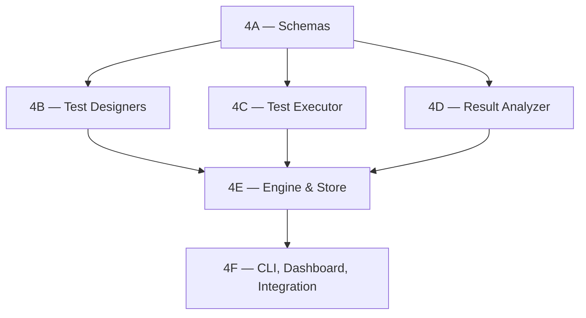

# Phase 4 — Auto-Investigation Loop

**Target:** CoreMind v2
**Duration estimate:** 1 week
**Agent:** Opus in VS Code
**Prerequisites:** None (can be implemented standalone)

---

## Subphases

| Subphase | Title | Effort | Prerequisites |
| --- | --- | --- | --- |
| [4A](PHASE_4A_INVESTIGATION_SCHEMAS.md) | Schemas & Package Scaffold | 1–2h | None |
| [4B](PHASE_4B_TEST_DESIGNERS.md) | Test Designers | 2–3h | 4A |
| [4C](PHASE_4C_TEST_EXECUTOR.md) | Test Executor | 3–4h | 4A |
| [4D](PHASE_4D_RESULT_ANALYZER.md) | Result Analyzer | 2–3h | 4A |
| [4E](PHASE_4E_ENGINE_STORE.md) | Investigation Engine & Store | 3–4h | 4A, 4B, 4C, 4D |
| [4F](PHASE_4F_CLI_DASHBOARD_INTEGRATION.md) | CLI, Dashboard & Integration | 3–4h | 4E |

### Dependency Graph



### Parallelism

After completing **4A**, subphases **4B, 4C, and 4D can all be executed in parallel** — they depend only on 4A (schemas) and not on each other. This is the main parallelization opportunity.

---

## 1. Problem Statement

In production, CoreMind v1 displays anomalies without resolving them. Real cases observed:

| Anomaly displayed | Reality | What v1 does |
|---|---|---|
| "Roborock hasn't cleaned since May 17" | Cleaned May 24 | Re-states the claim for days |
| "Light bureau is unavailable" | Device offline | Re-states with no diagnosis |
| "Health data anomaly: 36 steps today" | Sync issue | Re-states every cycle |
| "Calendar shows event in the past" | Stale snapshot | Repeats the past-date error |

The existing `stale_investigation_pruner.py` (added recently) catches obvious date-based staleness but **doesn't verify the underlying facts**. The system needs to **actively investigate** anomalies — design a test, execute it, draw a conclusion — rather than just flagging and re-flagging.

### Inspiration: Andrej Karpathy's AutoResearch

Karpathy's AutoResearch system ran 700 experiments in 2 days and discovered 20 hyperparameter optimizations autonomously. The pattern:

1. **Form hypothesis** from observed data
2. **Design experiment** to test it
3. **Execute experiment**
4. **Analyze results**
5. **Update knowledge** based on outcome

We apply this pattern to anomaly investigation.

---

## 2. Design

### 2.1 Investigation Lifecycle

```
        ┌───────────────────────┐
        │ L4 detects anomaly    │
        └──────────┬────────────┘
                   ▼
        ┌───────────────────────┐
        │ FORMED                 │  Investigation created
        │ - anomaly_description  │
        │ - hypothesis           │
        └──────────┬────────────┘
                   ▼
        ┌───────────────────────┐
        │ DESIGNING_TEST         │  Test designer picks strategy
        └──────────┬────────────┘
                   ▼
        ┌───────────────────────┐
        │ EXECUTING_TEST         │  Engine runs test (max 30s)
        └──────────┬────────────┘
                   ▼
        ┌───────────────────────┐
        │ ANALYZING              │  Compare result to hypothesis
        └──────────┬────────────┘
                   ▼
            ┌──────┴──────┐
            ▼      ▼      ▼
        RESOLVED  UNRESOLVED  ESCALATED
        (silent)  (re-queue)  (notify user)
```

### 2.2 Anomaly Types & Test Designers

Each anomaly type has a designated `TestDesigner` that knows how to verify it:

| Anomaly Type | Test Strategy | Plugin |
|---|---|---|
| `stale_date_claim` | Query primary source for actual timestamp | HA, plugin-specific |
| `device_unavailable` | Ping HA API, check `last_seen`, check power | HA |
| `data_anomaly_numeric` | Query raw data, compute baseline from N days | Plugin-specific |
| `missing_data` | Check plugin health endpoint, verify connectivity | Plugin manager |
| `pattern_change` | Compare to embedding similarity matches | Embedding pipeline (Phase 3) |
| `service_degraded` | Check service health, latency | Plugin-specific |
| `inconsistent_state` | Re-query authoritative source | Plugin-specific |

### 2.3 Component Architecture

```
┌─────────────────────────────────────────────────────────────────┐
│  L4 — Reasoning detects anomaly                                  │
│                                                                  │
│  emit: anomaly_detected(description, type, metadata)             │
│                                                                  │
└────────────────────────┬─────────────────────────────────────────┘
                         │
                         ▼
┌─────────────────────────────────────────────────────────────────┐
│  InvestigationEngine                                              │
│                                                                  │
│  1. Receive anomaly                                               │
│  2. Lookup TestDesigner by anomaly type                          │
│  3. Build InvestigationRun (status=FORMED)                       │
│  4. Persist to SurrealDB                                          │
│                                                                  │
│  5. Schedule execution (max 3 concurrent)                         │
│                                                                  │
│  ┌─────────────────────┐    ┌─────────────────────┐              │
│  │  TestDesigner       │───▶│  InvestigationTest  │              │
│  │  (per anomaly type) │    │  (concrete test)    │              │
│  └─────────────────────┘    └──────────┬──────────┘              │
│                                         ▼                         │
│                            ┌────────────────────────┐             │
│                            │  TestExecutor          │             │
│                            │  (timeout=30s)         │             │
│                            └────────────┬───────────┘             │
│                                         ▼                         │
│                            ┌────────────────────────┐             │
│                            │  ResultAnalyzer        │             │
│                            └────────────┬───────────┘             │
│                                         ▼                         │
│              ┌──────────────────────────┼─────────────────────┐   │
│              ▼                          ▼                     ▼   │
│         RESOLVED                   UNRESOLVED              ESCALATED
│  Update narrative_state          Retry up to 2x       Notify user
│  Remove from active                  Then escalate    with evidence
└─────────────────────────────────────────────────────────────────┘
```

---

## 3. Data Model

```python
class InvestigationStatus(str, enum.Enum):
    FORMED = "formed"
    DESIGNING_TEST = "designing_test"
    EXECUTING_TEST = "executing_test"
    ANALYZING = "analyzing"
    RESOLVED = "resolved"           # Anomaly disproven or explained
    UNRESOLVED = "unresolved"       # Test inconclusive, will retry
    ESCALATED = "escalated"         # Confirmed, user notified


class AnomalyType(str, enum.Enum):
    STALE_DATE_CLAIM = "stale_date_claim"
    DEVICE_UNAVAILABLE = "device_unavailable"
    DATA_ANOMALY_NUMERIC = "data_anomaly_numeric"
    MISSING_DATA = "missing_data"
    PATTERN_CHANGE = "pattern_change"
    SERVICE_DEGRADED = "service_degraded"
    INCONSISTENT_STATE = "inconsistent_state"
    UNKNOWN = "unknown"


class InvestigationTest(BaseModel):
    """A concrete test to execute."""
    test_id: str = Field(default_factory=lambda: str(uuid.uuid4()))
    test_type: str                  # "ha_query", "plugin_call", "embedding_compare", etc.
    description: str                # Human-readable: "Query HA for last clean time"
    parameters: dict[str, Any]      # Test-specific parameters
    timeout_seconds: float = 30.0
    plugin_id: str | None = None    # Which plugin to invoke (if any)


class InvestigationResult(BaseModel):
    """The result of executing a single test."""
    test_id: str
    success: bool                   # Did test complete without error?
    raw_output: dict[str, Any]
    error: str | None = None
    duration_seconds: float
    executed_at: datetime = Field(default_factory=lambda: datetime.now(UTC))


class InvestigationConclusion(BaseModel):
    """Final determination after analyzing test results."""
    verdict: Literal["resolved", "unresolved", "escalated"]
    confidence: float = Field(ge=0.0, le=1.0)
    reasoning: str                  # Why we reached this verdict
    user_message: str | None = None # If escalated, what to tell the user
    suggested_action: str | None = None


class InvestigationRun(BaseModel):
    """Top-level container for an investigation."""
    investigation_id: str = Field(default_factory=lambda: str(uuid.uuid4()))

    # Anomaly being investigated
    anomaly_description: str
    anomaly_type: AnomalyType
    anomaly_metadata: dict[str, Any] = Field(default_factory=dict)

    # Hypothesis under test
    hypothesis: str

    # Lifecycle
    status: InvestigationStatus = InvestigationStatus.FORMED

    # Tests & results
    tests: list[InvestigationTest] = Field(default_factory=list)
    results: list[InvestigationResult] = Field(default_factory=list)

    # Conclusion
    conclusion: InvestigationConclusion | None = None

    # Timing
    started_at: datetime = Field(default_factory=lambda: datetime.now(UTC))
    completed_at: datetime | None = None

    # Retry tracking
    retry_count: int = 0
    max_retries: int = 2

    # Audit
    related_intent_ids: list[str] = Field(default_factory=list)
```

---

## 4. Components

### 4.1 TestDesigner Base & Implementations

```python
class TestDesigner(ABC):
    """Base class for test designers."""

    @abstractmethod
    def applies_to(self, anomaly_type: AnomalyType) -> bool:
        """Does this designer handle this anomaly type?"""
        ...

    @abstractmethod
    async def design(self, anomaly: AnomalyContext) -> list[InvestigationTest]:
        """Design one or more tests to verify the anomaly."""
        ...


class AnomalyContext(BaseModel):
    """Context passed to test designers."""
    description: str
    anomaly_type: AnomalyType
    metadata: dict[str, Any]
    related_entities: list[str] = Field(default_factory=list)


class StaleDateTestDesigner(TestDesigner):
    """Test for 'X hasn't happened since DATE' claims."""

    def applies_to(self, anomaly_type: AnomalyType) -> bool:
        return anomaly_type == AnomalyType.STALE_DATE_CLAIM

    async def design(self, anomaly: AnomalyContext) -> list[InvestigationTest]:
        # Extract entity from metadata
        entity_id = anomaly.metadata.get("entity_id")
        attribute = anomaly.metadata.get("attribute", "last_changed")
        claimed_date = anomaly.metadata.get("claimed_date")

        if not entity_id:
            return []

        return [
            InvestigationTest(
                test_type="ha_query_entity",
                description=f"Query HA for current state of {entity_id}",
                parameters={
                    "entity_id": entity_id,
                    "attribute": attribute,
                    "claimed_date": claimed_date,
                },
                timeout_seconds=10.0,
                plugin_id="homeassistant",
            ),
        ]


class DeviceUnavailableTestDesigner(TestDesigner):
    """Test for 'device X is unavailable'."""

    def applies_to(self, anomaly_type: AnomalyType) -> bool:
        return anomaly_type == AnomalyType.DEVICE_UNAVAILABLE

    async def design(self, anomaly: AnomalyContext) -> list[InvestigationTest]:
        entity_id = anomaly.metadata.get("entity_id")
        if not entity_id:
            return []
        return [
            InvestigationTest(
                test_type="ha_check_availability",
                description=f"Check current availability of {entity_id}",
                parameters={"entity_id": entity_id},
                timeout_seconds=10.0,
                plugin_id="homeassistant",
            ),
            InvestigationTest(
                test_type="ha_check_last_seen",
                description=f"Find last successful state change for {entity_id}",
                parameters={"entity_id": entity_id, "lookback_hours": 168},
                timeout_seconds=15.0,
                plugin_id="homeassistant",
            ),
        ]


class NumericAnomalyTestDesigner(TestDesigner):
    """Test for 'value X is anomalous'."""

    def applies_to(self, anomaly_type: AnomalyType) -> bool:
        return anomaly_type == AnomalyType.DATA_ANOMALY_NUMERIC

    async def design(self, anomaly: AnomalyContext) -> list[InvestigationTest]:
        entity_id = anomaly.metadata.get("entity_id")
        attribute = anomaly.metadata.get("attribute")
        observed_value = anomaly.metadata.get("observed_value")

        if not (entity_id and attribute):
            return []

        return [
            InvestigationTest(
                test_type="influx_baseline_query",
                description=f"Compute 30-day baseline for {entity_id}.{attribute}",
                parameters={
                    "entity_id": entity_id,
                    "attribute": attribute,
                    "lookback_days": 30,
                    "observed_value": observed_value,
                },
                timeout_seconds=20.0,
            ),
            InvestigationTest(
                test_type="ha_query_entity",
                description=f"Re-query current value of {entity_id}",
                parameters={"entity_id": entity_id, "attribute": attribute},
                timeout_seconds=10.0,
                plugin_id="homeassistant",
            ),
        ]


class MissingDataTestDesigner(TestDesigner):
    """Test for 'no recent data from plugin X'."""

    def applies_to(self, anomaly_type: AnomalyType) -> bool:
        return anomaly_type == AnomalyType.MISSING_DATA

    async def design(self, anomaly: AnomalyContext) -> list[InvestigationTest]:
        plugin_id = anomaly.metadata.get("plugin_id")
        if not plugin_id:
            return []
        return [
            InvestigationTest(
                test_type="plugin_health_check",
                description=f"Check {plugin_id} plugin health",
                parameters={"plugin_id": plugin_id},
                timeout_seconds=10.0,
            ),
            InvestigationTest(
                test_type="plugin_force_poll",
                description=f"Force poll on {plugin_id}",
                parameters={"plugin_id": plugin_id},
                timeout_seconds=30.0,
            ),
        ]


class PatternChangeTestDesigner(TestDesigner):
    """Test for unusual patterns using embedding similarity."""

    def applies_to(self, anomaly_type: AnomalyType) -> bool:
        return anomaly_type == AnomalyType.PATTERN_CHANGE

    async def design(self, anomaly: AnomalyContext) -> list[InvestigationTest]:
        return [
            InvestigationTest(
                test_type="embedding_similarity_lookup",
                description="Compare current state to last 30 days",
                parameters={
                    "current_snapshot_id": anomaly.metadata.get("snapshot_id"),
                    "lookback_days": 30,
                    "top_k": 5,
                },
                timeout_seconds=15.0,
            ),
        ]
```

### 4.2 TestExecutor

```python
class TestExecutor:
    """Executes investigation tests via the plugin infrastructure."""

    def __init__(
        self,
        plugin_manager,
        ha_client,
        influx_client,
        embedding_pipeline,  # From Phase 3
    ):
        self._plugins = plugin_manager
        self._ha = ha_client
        self._influx = influx_client
        self._embeddings = embedding_pipeline

        # Dispatch table
        self._executors: dict[str, Callable] = {
            "ha_query_entity": self._exec_ha_query_entity,
            "ha_check_availability": self._exec_ha_check_availability,
            "ha_check_last_seen": self._exec_ha_check_last_seen,
            "influx_baseline_query": self._exec_influx_baseline,
            "plugin_health_check": self._exec_plugin_health,
            "plugin_force_poll": self._exec_plugin_force_poll,
            "embedding_similarity_lookup": self._exec_embedding_similarity,
        }

    async def execute(self, test: InvestigationTest) -> InvestigationResult:
        """Execute a single test with timeout protection."""
        start = time.perf_counter()

        executor = self._executors.get(test.test_type)
        if not executor:
            return InvestigationResult(
                test_id=test.test_id,
                success=False,
                raw_output={},
                error=f"No executor for test type: {test.test_type}",
                duration_seconds=0.0,
            )

        try:
            output = await asyncio.wait_for(
                executor(test.parameters),
                timeout=test.timeout_seconds,
            )
            return InvestigationResult(
                test_id=test.test_id,
                success=True,
                raw_output=output,
                duration_seconds=time.perf_counter() - start,
            )
        except asyncio.TimeoutError:
            return InvestigationResult(
                test_id=test.test_id,
                success=False,
                raw_output={},
                error=f"Test timed out after {test.timeout_seconds}s",
                duration_seconds=test.timeout_seconds,
            )
        except Exception as e:
            return InvestigationResult(
                test_id=test.test_id,
                success=False,
                raw_output={},
                error=str(e),
                duration_seconds=time.perf_counter() - start,
            )

    async def _exec_ha_query_entity(self, params: dict) -> dict:
        entity_id = params["entity_id"]
        state = await self._ha.get_state(entity_id)
        return {
            "entity_id": entity_id,
            "state": state.state,
            "attributes": state.attributes,
            "last_changed": state.last_changed.isoformat() if state.last_changed else None,
            "last_updated": state.last_updated.isoformat() if state.last_updated else None,
        }

    async def _exec_ha_check_availability(self, params: dict) -> dict:
        entity_id = params["entity_id"]
        state = await self._ha.get_state(entity_id)
        return {
            "entity_id": entity_id,
            "available": state.state not in ("unavailable", "unknown"),
            "current_state": state.state,
        }

    async def _exec_ha_check_last_seen(self, params: dict) -> dict:
        entity_id = params["entity_id"]
        lookback_hours = params.get("lookback_hours", 168)
        history = await self._ha.get_history(
            entity_id,
            start=datetime.now(UTC) - timedelta(hours=lookback_hours),
        )
        valid_states = [
            s for s in history
            if s.state not in ("unavailable", "unknown")
        ]
        last_valid = valid_states[-1] if valid_states else None
        return {
            "entity_id": entity_id,
            "last_valid_state": last_valid.state if last_valid else None,
            "last_valid_at": last_valid.last_changed.isoformat() if last_valid else None,
            "lookback_hours": lookback_hours,
        }

    async def _exec_influx_baseline(self, params: dict) -> dict:
        entity_id = params["entity_id"]
        attribute = params["attribute"]
        lookback_days = params.get("lookback_days", 30)
        observed_value = params.get("observed_value")

        # Query InfluxDB for historical values
        values = await self._influx.query_attribute_history(
            entity_id=entity_id,
            attribute=attribute,
            lookback=timedelta(days=lookback_days),
        )

        if not values:
            return {"error": "no historical data", "entity_id": entity_id}

        import statistics
        mean = statistics.mean(values)
        stdev = statistics.stdev(values) if len(values) > 1 else 0
        z_score = (observed_value - mean) / stdev if (stdev > 0 and observed_value is not None) else None

        return {
            "entity_id": entity_id,
            "attribute": attribute,
            "sample_count": len(values),
            "mean": mean,
            "stdev": stdev,
            "min": min(values),
            "max": max(values),
            "observed_value": observed_value,
            "z_score": z_score,
            "is_anomalous": z_score is not None and abs(z_score) > 3,
        }

    async def _exec_plugin_health(self, params: dict) -> dict:
        plugin_id = params["plugin_id"]
        info = await self._plugins.get_health(plugin_id)
        return {
            "plugin_id": plugin_id,
            "alive": info.alive,
            "last_successful_poll": info.last_success.isoformat() if info.last_success else None,
            "error_rate_1h": info.error_rate_1h,
            "latency_p95_ms": info.latency_p95_ms,
        }

    async def _exec_plugin_force_poll(self, params: dict) -> dict:
        plugin_id = params["plugin_id"]
        result = await self._plugins.force_poll(plugin_id)
        return {
            "plugin_id": plugin_id,
            "poll_success": result.success,
            "entities_returned": result.entity_count,
            "error": result.error,
        }

    async def _exec_embedding_similarity(self, params: dict) -> dict:
        snapshot_id = params["current_snapshot_id"]
        top_k = params.get("top_k", 5)

        # Get embedding for this snapshot
        current_embedding = await self._embeddings.memory.get_embedding(snapshot_id)
        if current_embedding is None:
            return {"error": "no embedding available", "snapshot_id": snapshot_id}

        similar = await self._embeddings.memory.find_similar(current_embedding, k=top_k)
        return {
            "snapshot_id": snapshot_id,
            "similar_snapshots": [
                {
                    "id": s.snapshot_id,
                    "score": s.score,
                    "summary": s.summary,
                    "timestamp": s.timestamp.isoformat(),
                }
                for s in similar
            ],
            "highest_similarity": similar[0].score if similar else 0.0,
        }
```

### 4.3 ResultAnalyzer

```python
class ResultAnalyzer:
    """Analyzes test results and produces a conclusion."""

    def __init__(self, llm_client: LLMClient | None = None):
        # LLM is optional — most analysis is rule-based
        self._llm = llm_client

        self._analyzers: dict[AnomalyType, Callable] = {
            AnomalyType.STALE_DATE_CLAIM: self._analyze_stale_date,
            AnomalyType.DEVICE_UNAVAILABLE: self._analyze_unavailable,
            AnomalyType.DATA_ANOMALY_NUMERIC: self._analyze_numeric,
            AnomalyType.MISSING_DATA: self._analyze_missing_data,
            AnomalyType.PATTERN_CHANGE: self._analyze_pattern,
        }

    async def analyze(
        self,
        investigation: InvestigationRun,
    ) -> InvestigationConclusion:
        """Produce a conclusion from the investigation's test results."""
        # Pick rule-based analyzer
        analyzer = self._analyzers.get(investigation.anomaly_type)
        if analyzer:
            return await analyzer(investigation)

        # Fallback to LLM-based analysis
        if self._llm:
            return await self._llm_analyze(investigation)

        # Last resort
        return InvestigationConclusion(
            verdict="unresolved",
            confidence=0.3,
            reasoning=f"No analyzer for anomaly type {investigation.anomaly_type}",
        )

    async def _analyze_stale_date(self, inv: InvestigationRun) -> InvestigationConclusion:
        """For 'X hasn't happened since DATE' claims, check if actual date is newer."""
        if not inv.results:
            return InvestigationConclusion(
                verdict="unresolved",
                confidence=0.0,
                reasoning="No test results to analyze",
            )

        result = inv.results[0]
        if not result.success:
            return InvestigationConclusion(
                verdict="unresolved",
                confidence=0.2,
                reasoning=f"Test failed: {result.error}",
            )

        # Parse the actual date from result
        attribute = inv.anomaly_metadata.get("attribute", "last_changed")
        actual_date_str = result.raw_output.get(attribute)
        claimed_date_str = inv.anomaly_metadata.get("claimed_date")

        if not actual_date_str or not claimed_date_str:
            return InvestigationConclusion(
                verdict="unresolved",
                confidence=0.3,
                reasoning="Could not extract dates for comparison",
            )

        actual_date = datetime.fromisoformat(actual_date_str.replace("Z", "+00:00"))
        claimed_date = datetime.fromisoformat(claimed_date_str.replace("Z", "+00:00"))

        if actual_date > claimed_date:
            return InvestigationConclusion(
                verdict="resolved",
                confidence=0.95,
                reasoning=(
                    f"Claim was stale. Actual {attribute}: {actual_date.isoformat()}. "
                    f"Claim said: {claimed_date.isoformat()}. Difference: "
                    f"{(actual_date - claimed_date).days} days."
                ),
            )
        else:
            # Claim was accurate — anomaly confirmed
            days_ago = (datetime.now(UTC) - actual_date).days
            return InvestigationConclusion(
                verdict="escalated",
                confidence=0.9,
                reasoning=(
                    f"Anomaly confirmed. Actual {attribute}: {actual_date.isoformat()} "
                    f"({days_ago} days ago)."
                ),
                user_message=(
                    f"I checked. {inv.anomaly_description} — confirmed. "
                    f"Last activity: {actual_date.isoformat()} ({days_ago} days ago)."
                ),
                suggested_action="Investigate why no activity has occurred",
            )

    async def _analyze_unavailable(self, inv: InvestigationRun) -> InvestigationConclusion:
        """For 'device X unavailable' anomalies."""
        if len(inv.results) < 2:
            return InvestigationConclusion(verdict="unresolved", confidence=0.2, reasoning="Insufficient results")

        availability_test = inv.results[0]
        last_seen_test = inv.results[1]

        if availability_test.success and availability_test.raw_output.get("available"):
            return InvestigationConclusion(
                verdict="resolved",
                confidence=0.95,
                reasoning=(
                    f"Device is now available. Current state: "
                    f"{availability_test.raw_output.get('current_state')}"
                ),
            )

        # Still unavailable. How long?
        last_seen = last_seen_test.raw_output.get("last_valid_at")
        if last_seen:
            last_dt = datetime.fromisoformat(last_seen.replace("Z", "+00:00"))
            hours_offline = (datetime.now(UTC) - last_dt).total_seconds() / 3600
            return InvestigationConclusion(
                verdict="escalated",
                confidence=0.9,
                reasoning=f"Device offline for {hours_offline:.1f}h since {last_seen}",
                user_message=(
                    f"Device {inv.anomaly_metadata.get('entity_id')} has been offline "
                    f"for {hours_offline:.1f} hours (since {last_seen})."
                ),
                suggested_action="Check power, network, or restart the device",
            )

        return InvestigationConclusion(
            verdict="escalated",
            confidence=0.7,
            reasoning="Device unavailable, no historical state found",
            user_message=f"Device {inv.anomaly_metadata.get('entity_id')} is unavailable with no recent valid state.",
        )

    async def _analyze_numeric(self, inv: InvestigationRun) -> InvestigationConclusion:
        """For numeric anomalies (e.g., '36 steps today')."""
        if len(inv.results) < 2:
            return InvestigationConclusion(verdict="unresolved", confidence=0.2, reasoning="Insufficient results")

        baseline = inv.results[0].raw_output
        current = inv.results[1].raw_output

        observed = baseline.get("observed_value")
        z_score = baseline.get("z_score")

        if z_score is None:
            return InvestigationConclusion(
                verdict="unresolved",
                confidence=0.3,
                reasoning="Could not compute z-score (insufficient history)",
            )

        if abs(z_score) > 3:
            # Confirmed anomaly
            return InvestigationConclusion(
                verdict="escalated",
                confidence=0.9,
                reasoning=(
                    f"Confirmed anomaly. Observed: {observed}, "
                    f"baseline mean: {baseline['mean']:.1f} ± {baseline['stdev']:.1f}, "
                    f"z-score: {z_score:.2f}"
                ),
                user_message=(
                    f"Anomaly confirmed: value {observed} is {abs(z_score):.1f} stdev from "
                    f"the 30-day baseline ({baseline['mean']:.1f} ± {baseline['stdev']:.1f})."
                ),
            )
        else:
            return InvestigationConclusion(
                verdict="resolved",
                confidence=0.9,
                reasoning=(
                    f"Value {observed} is within normal range "
                    f"(baseline {baseline['mean']:.1f} ± {baseline['stdev']:.1f}, z-score {z_score:.2f})"
                ),
            )

    async def _analyze_missing_data(self, inv: InvestigationRun) -> InvestigationConclusion:
        """For 'no data from plugin X' anomalies."""
        if not inv.results:
            return InvestigationConclusion(verdict="unresolved", confidence=0.0, reasoning="No results")

        health = inv.results[0].raw_output
        force_poll = inv.results[1].raw_output if len(inv.results) > 1 else {}

        if force_poll.get("poll_success") and force_poll.get("entities_returned", 0) > 0:
            return InvestigationConclusion(
                verdict="resolved",
                confidence=0.85,
                reasoning=f"Plugin responded successfully after force poll, returned {force_poll['entities_returned']} entities",
            )

        if not health.get("alive"):
            return InvestigationConclusion(
                verdict="escalated",
                confidence=0.95,
                reasoning=f"Plugin {inv.anomaly_metadata.get('plugin_id')} is dead",
                user_message=(
                    f"Plugin {inv.anomaly_metadata.get('plugin_id')} is unresponsive. "
                    f"Last success: {health.get('last_successful_poll')}, "
                    f"error rate: {health.get('error_rate_1h', 0):.1%}"
                ),
                suggested_action=f"Restart the {inv.anomaly_metadata.get('plugin_id')} plugin",
            )

        error_rate = health.get("error_rate_1h", 0)
        if error_rate > 0.5:
            return InvestigationConclusion(
                verdict="escalated",
                confidence=0.85,
                reasoning=f"Plugin alive but {error_rate:.1%} error rate",
                user_message=f"Plugin has degraded performance: {error_rate:.1%} errors in the last hour.",
            )

        return InvestigationConclusion(
            verdict="unresolved",
            confidence=0.4,
            reasoning="Plugin appears healthy but data was missing — possibly transient",
        )

    async def _analyze_pattern(self, inv: InvestigationRun) -> InvestigationConclusion:
        """For pattern-change anomalies using embedding similarity."""
        if not inv.results:
            return InvestigationConclusion(verdict="unresolved", confidence=0.0, reasoning="No results")

        result = inv.results[0].raw_output
        highest_sim = result.get("highest_similarity", 0)
        similar = result.get("similar_snapshots", [])

        if highest_sim > 0.9:
            return InvestigationConclusion(
                verdict="resolved",
                confidence=0.85,
                reasoning=f"Current state is similar (sim={highest_sim:.2f}) to past states — not a true anomaly",
            )

        if highest_sim < 0.5:
            return InvestigationConclusion(
                verdict="escalated",
                confidence=0.85,
                reasoning=f"Current state has no close historical match (best sim={highest_sim:.2f}). Unusual pattern.",
                user_message=(
                    f"Current system state doesn't match any of the last 30 days well "
                    f"(best similarity: {highest_sim:.2f}). Worth a look?"
                ),
            )

        return InvestigationConclusion(
            verdict="unresolved",
            confidence=0.5,
            reasoning=f"Moderate similarity ({highest_sim:.2f}) — ambiguous",
        )

    async def _llm_analyze(self, inv: InvestigationRun) -> InvestigationConclusion:
        """Fallback to LLM analysis for unhandled anomaly types."""
        prompt = self._build_llm_prompt(inv)
        response = await self._llm.complete(prompt, max_tokens=500)
        return self._parse_llm_conclusion(response)
```

### 4.4 InvestigationEngine

```python
class InvestigationEngine:
    """Orchestrates investigations end-to-end."""

    def __init__(
        self,
        designers: list[TestDesigner],
        executor: TestExecutor,
        analyzer: ResultAnalyzer,
        store: InvestigationStore,
        narrative_store,
        event_bus,
        config: InvestigationConfig,
    ):
        self._designers = designers
        self._executor = executor
        self._analyzer = analyzer
        self._store = store
        self._narrative = narrative_store
        self._bus = event_bus
        self._config = config

        self._semaphore = asyncio.Semaphore(config.max_concurrent)
        self._active: dict[str, asyncio.Task] = {}

    async def investigate(self, anomaly: AnomalyContext) -> str:
        """Start an investigation for an anomaly. Returns investigation_id."""
        # Check for existing active investigation on same entity
        existing = await self._store.find_active(
            anomaly_type=anomaly.anomaly_type,
            entity_id=anomaly.metadata.get("entity_id"),
        )
        if existing:
            log.debug(
                "investigation.duplicate_skipped",
                anomaly_type=anomaly.anomaly_type.value,
                existing_id=existing.investigation_id,
            )
            return existing.investigation_id

        # Build investigation record
        run = InvestigationRun(
            anomaly_description=anomaly.description,
            anomaly_type=anomaly.anomaly_type,
            anomaly_metadata=anomaly.metadata,
            hypothesis=self._formulate_hypothesis(anomaly),
            status=InvestigationStatus.FORMED,
        )
        await self._store.save(run)

        # Launch in background
        task = asyncio.create_task(self._run_investigation(run))
        self._active[run.investigation_id] = task
        task.add_done_callback(lambda t: self._active.pop(run.investigation_id, None))

        return run.investigation_id

    async def _run_investigation(self, run: InvestigationRun) -> None:
        async with self._semaphore:
            try:
                # Design phase
                run.status = InvestigationStatus.DESIGNING_TEST
                await self._store.save(run)

                designer = self._find_designer(run.anomaly_type)
                if not designer:
                    run.status = InvestigationStatus.UNRESOLVED
                    run.conclusion = InvestigationConclusion(
                        verdict="unresolved",
                        confidence=0.0,
                        reasoning=f"No test designer for anomaly type {run.anomaly_type}",
                    )
                    run.completed_at = datetime.now(UTC)
                    await self._store.save(run)
                    return

                anomaly_ctx = AnomalyContext(
                    description=run.anomaly_description,
                    anomaly_type=run.anomaly_type,
                    metadata=run.anomaly_metadata,
                )
                run.tests = await designer.design(anomaly_ctx)
                await self._store.save(run)

                if not run.tests:
                    run.status = InvestigationStatus.UNRESOLVED
                    run.conclusion = InvestigationConclusion(
                        verdict="unresolved",
                        confidence=0.0,
                        reasoning="No tests designed",
                    )
                    run.completed_at = datetime.now(UTC)
                    await self._store.save(run)
                    return

                # Execute phase
                run.status = InvestigationStatus.EXECUTING_TEST
                await self._store.save(run)

                results = await asyncio.gather(*[
                    self._executor.execute(test) for test in run.tests
                ])
                run.results = list(results)
                await self._store.save(run)

                # Analyze phase
                run.status = InvestigationStatus.ANALYZING
                await self._store.save(run)

                conclusion = await self._analyzer.analyze(run)
                run.conclusion = conclusion

                # Apply verdict
                if conclusion.verdict == "resolved":
                    run.status = InvestigationStatus.RESOLVED
                    await self._handle_resolution(run)
                elif conclusion.verdict == "escalated":
                    run.status = InvestigationStatus.ESCALATED
                    await self._handle_escalation(run)
                else:  # unresolved
                    if run.retry_count < run.max_retries:
                        run.retry_count += 1
                        # Re-queue for later (handled by scheduler)
                        run.status = InvestigationStatus.FORMED
                    else:
                        run.status = InvestigationStatus.ESCALATED
                        run.conclusion.verdict = "escalated"
                        run.conclusion.user_message = (
                            f"Couldn't confirm or refute: {run.anomaly_description}. "
                            f"Tried {run.max_retries + 1} times."
                        )
                        await self._handle_escalation(run)

                run.completed_at = datetime.now(UTC)
                await self._store.save(run)

            except Exception as e:
                log.exception("investigation.failed", investigation_id=run.investigation_id, error=str(e))
                run.status = InvestigationStatus.UNRESOLVED
                run.completed_at = datetime.now(UTC)
                run.conclusion = InvestigationConclusion(
                    verdict="unresolved",
                    confidence=0.0,
                    reasoning=f"Investigation failed with exception: {e}",
                )
                await self._store.save(run)

    def _find_designer(self, anomaly_type: AnomalyType) -> TestDesigner | None:
        for designer in self._designers:
            if designer.applies_to(anomaly_type):
                return designer
        return None

    def _formulate_hypothesis(self, anomaly: AnomalyContext) -> str:
        """Generate a testable hypothesis from the anomaly."""
        if anomaly.anomaly_type == AnomalyType.STALE_DATE_CLAIM:
            return (
                f"The claim '{anomaly.description}' may be stale — the actual "
                f"date might be more recent than what the snapshot shows."
            )
        elif anomaly.anomaly_type == AnomalyType.DEVICE_UNAVAILABLE:
            return f"Device {anomaly.metadata.get('entity_id')} is genuinely offline or has recovered since detection."
        elif anomaly.anomaly_type == AnomalyType.DATA_ANOMALY_NUMERIC:
            return f"Value {anomaly.metadata.get('observed_value')} is either anomalous (outside 3σ) or normal variation."
        # ... etc
        return f"Need to verify: {anomaly.description}"

    async def _handle_resolution(self, run: InvestigationRun) -> None:
        """A resolved investigation — silent, just update narrative."""
        await self._narrative.update_resolution(
            investigation_id=run.investigation_id,
            description=run.anomaly_description,
            resolution=run.conclusion.reasoning,
        )
        # Mark anomaly as inactive
        if entity_id := run.anomaly_metadata.get("entity_id"):
            await self._narrative.mark_anomaly_resolved(entity_id, run.anomaly_type.value)

        log.info(
            "investigation.resolved",
            investigation_id=run.investigation_id,
            reasoning=run.conclusion.reasoning,
        )

    async def _handle_escalation(self, run: InvestigationRun) -> None:
        """An escalated investigation — notify user."""
        await self._bus.publish("investigation.escalated", {
            "investigation_id": run.investigation_id,
            "user_message": run.conclusion.user_message,
            "suggested_action": run.conclusion.suggested_action,
            "evidence": [r.raw_output for r in run.results if r.success],
        })


class InvestigationConfig(BaseModel):
    enabled: bool = True
    max_concurrent: int = 3
    default_timeout_seconds: float = 30.0
    max_retries: int = 2
    retention_days: int = 30


class InvestigationStore:
    """Persists investigations to SurrealDB."""

    async def save(self, run: InvestigationRun) -> None: ...
    async def get(self, investigation_id: str) -> InvestigationRun | None: ...
    async def find_active(self, anomaly_type: AnomalyType, entity_id: str | None) -> InvestigationRun | None: ...
    async def list_recent(self, limit: int = 50) -> list[InvestigationRun]: ...
    async def prune(self, retention_days: int) -> int: ...
```

---

## 5. Integration With Stale Pruner

The existing `stale_investigation_pruner.py` will be **enhanced**, not replaced:

| Concern | v1 pruner | v2 (with auto-investigation) |
|---|---|---|
| Detection | Date-pattern regex | Date-pattern regex |
| Removal | Time-based heuristic | Active verification via investigation |
| Resolution proof | None | Logged conclusion in `investigation_run` |

**Integration flow:**

```python
# Before pruner removes a stale-looking investigation, fire an auto-investigation
async def prune_with_verification(
    pruner: StaleInvestigationPruner,
    engine: InvestigationEngine,
    snapshot: WorldSnapshot,
) -> list[str]:
    """Verify stale claims by running investigations before pruning."""
    candidates = pruner.find_stale_candidates(snapshot)
    pruned = []

    for candidate in candidates:
        # Trigger investigation for each stale-looking claim
        anomaly = AnomalyContext(
            description=candidate.text,
            anomaly_type=AnomalyType.STALE_DATE_CLAIM,
            metadata={
                "entity_id": candidate.entity_id,
                "attribute": "last_changed",
                "claimed_date": candidate.claimed_date,
            },
        )
        inv_id = await engine.investigate(anomaly)
        # Don't wait — investigation runs async, will resolve via narrative
        pruned.append(candidate.investigation_id)

    return pruned
```

---

## 6. Files to Create/Modify

### New Files

| File | Purpose |
|---|---|
| `src/coremind/investigation/__init__.py` | Package init |
| `src/coremind/investigation/schemas.py` | All Pydantic models |
| `src/coremind/investigation/designers.py` | TestDesigner implementations |
| `src/coremind/investigation/executor.py` | TestExecutor |
| `src/coremind/investigation/analyzer.py` | ResultAnalyzer |
| `src/coremind/investigation/engine.py` | InvestigationEngine |
| `src/coremind/investigation/store.py` | InvestigationStore (SurrealDB) |
| `tests/test_investigation_designers.py` | Designer tests |
| `tests/test_investigation_executor.py` | Executor tests |
| `tests/test_investigation_analyzer.py` | Analyzer tests |
| `tests/test_investigation_engine.py` | Engine integration tests |

### Modified Files

| File | Change |
|---|---|
| `src/coremind/intention/loop.py` | When anomaly detected, call engine.investigate() |
| `src/coremind/intention/stale_investigation_pruner.py` | Hook into engine for verification |
| `src/coremind/reasoning/loop.py` | Receive investigation results in context |
| `src/coremind/core/daemon.py` | Initialize InvestigationEngine |
| `src/coremind/dashboard/views.py` | Add investigation history page |
| `src/coremind/cli/__init__.py` | Add `coremind investigations` commands |
| `~/.coremind/config.toml` | Add `[investigation]` section |

---

## 7. Configuration

```toml
[investigation]
enabled = true
max_concurrent = 3
default_timeout_seconds = 30.0
max_retries = 2
retention_days = 30

# Per-anomaly-type overrides
[investigation.anomaly_types.stale_date_claim]
enabled = true
auto_trigger = true                  # Auto-investigate when detected
auto_resolve = true                  # If verified stale, silently prune
escalation_cooldown_seconds = 86400  # Don't re-escalate same anomaly within 24h

[investigation.anomaly_types.device_unavailable]
enabled = true
auto_trigger = true
auto_resolve = false                 # Always escalate if confirmed
escalation_cooldown_seconds = 21600

# Notification channel for escalations
[investigation.notifications]
channel = "telegram"
include_evidence = true              # Include raw test results in notifications
```

---

## 8. CLI Commands

```bash
# List recent investigations
coremind investigations list
coremind investigations list --status resolved
coremind investigations list --last 24h

# Show full details of one investigation
coremind investigations show <id>

# Cancel an in-flight investigation
coremind investigations cancel <id>

# Manually trigger an investigation
coremind investigations trigger \
    --anomaly-type stale_date_claim \
    --entity-id "vacuum.s7_max_ultra" \
    --claimed-date "2026-05-17" \
    --description "Vacuum hasn't cleaned since 2026-05-17"

# Stats
coremind investigations stats
# Output:
# Investigations last 7d: 47
# Resolved: 31 (66%)
# Escalated: 12 (26%)
# Unresolved: 4 (8%)
# Avg duration: 8.2s
```

---

## 9. Dashboard

### `/investigations` Page

```
┌─ Investigation Stats (last 7 days) ─────────────────────────────┐
│                                                                  │
│  Total: 47        Resolved: 31 (66%)     Escalated: 12 (26%)     │
│                   Unresolved: 4 (8%)     Avg duration: 8.2s      │
│                                                                  │
└──────────────────────────────────────────────────────────────────┘

┌─ Active Investigations ──────────────────────────────────────────┐
│                                                                  │
│  ▸ light.bureau_unavailable                                       │
│    Status: EXECUTING_TEST       Started: 12s ago                  │
│    Tests: 2/2                                                     │
│    [Cancel]                                                       │
│                                                                  │
└──────────────────────────────────────────────────────────────────┘

┌─ Recent Investigations ──────────────────────────────────────────┐
│                                                                  │
│  ✓ Roborock 'hasn't cleaned since May 17'                          │
│    RESOLVED · 2 min ago · Claim was stale (actual: May 24)        │
│                                                                  │
│  🚨 Light bureau unavailable                                        │
│    ESCALATED · 1h ago · Offline for 73h since 2026-05-23          │
│                                                                  │
│  ? Health steps 36 today                                          │
│    UNRESOLVED · 3h ago · Insufficient baseline data               │
│                                                                  │
└──────────────────────────────────────────────────────────────────┘
```

---

## 10. Tests

### 10.1 Unit Tests

```python
# tests/test_investigation_designers.py
def test_stale_date_designer_creates_ha_query():
    designer = StaleDateTestDesigner()
    anomaly = AnomalyContext(
        description="Roborock hasn't cleaned since May 17",
        anomaly_type=AnomalyType.STALE_DATE_CLAIM,
        metadata={"entity_id": "vacuum.s7_max_ultra", "claimed_date": "2026-05-17"},
    )
    tests = await designer.design(anomaly)
    assert len(tests) == 1
    assert tests[0].test_type == "ha_query_entity"
    assert tests[0].parameters["entity_id"] == "vacuum.s7_max_ultra"


# tests/test_investigation_analyzer.py
def test_analyzer_resolves_when_actual_date_is_newer():
    inv = make_investigation(
        anomaly_type=AnomalyType.STALE_DATE_CLAIM,
        metadata={"claimed_date": "2026-05-17", "attribute": "last_changed"},
        results=[make_result(success=True, output={"last_changed": "2026-05-24T15:32:00+00:00"})],
    )
    analyzer = ResultAnalyzer()
    conclusion = await analyzer.analyze(inv)
    assert conclusion.verdict == "resolved"
    assert "stale" in conclusion.reasoning.lower()

def test_analyzer_escalates_when_anomaly_confirmed():
    inv = make_investigation(
        anomaly_type=AnomalyType.STALE_DATE_CLAIM,
        metadata={"claimed_date": "2026-05-17"},
        results=[make_result(success=True, output={"last_changed": "2026-05-16T00:00:00+00:00"})],
    )
    analyzer = ResultAnalyzer()
    conclusion = await analyzer.analyze(inv)
    assert conclusion.verdict == "escalated"
    assert conclusion.user_message is not None

def test_analyzer_handles_numeric_within_baseline():
    inv = make_investigation(
        anomaly_type=AnomalyType.DATA_ANOMALY_NUMERIC,
        results=[
            make_result(success=True, output={
                "mean": 5000, "stdev": 1500, "observed_value": 4800, "z_score": -0.13,
            }),
            make_result(success=True, output={"state": "4800"}),
        ],
    )
    analyzer = ResultAnalyzer()
    conclusion = await analyzer.analyze(inv)
    assert conclusion.verdict == "resolved"


# tests/test_investigation_engine.py
@pytest.mark.asyncio
async def test_engine_runs_full_lifecycle(mock_executor, mock_store, mock_analyzer):
    engine = InvestigationEngine(
        designers=[StaleDateTestDesigner()],
        executor=mock_executor,
        analyzer=mock_analyzer,
        store=mock_store,
        ...
    )
    inv_id = await engine.investigate(make_anomaly_context())
    await wait_for_completion(engine, inv_id)
    run = await mock_store.get(inv_id)
    assert run.status in (InvestigationStatus.RESOLVED, InvestigationStatus.ESCALATED, InvestigationStatus.UNRESOLVED)
    assert run.conclusion is not None

@pytest.mark.asyncio
async def test_engine_deduplicates_concurrent_investigations(mock_executor, mock_store, ...):
    """Same anomaly fired twice → only one investigation."""
    engine = InvestigationEngine(...)
    id1 = await engine.investigate(make_anomaly_context(entity_id="light.bureau"))
    id2 = await engine.investigate(make_anomaly_context(entity_id="light.bureau"))
    assert id1 == id2

@pytest.mark.asyncio
async def test_engine_respects_max_concurrent():
    """No more than 3 investigations run simultaneously."""
    engine = InvestigationEngine(max_concurrent=3, ...)
    # Launch 10 slow investigations
    ids = [await engine.investigate(...) for _ in range(10)]
    assert len(engine._active) <= 3
```

### 10.2 Integration Tests

```python
@pytest.mark.integration
async def test_real_world_stale_roborock_scenario():
    """Reproduce the actual production bug — stale Roborock claim."""
    # Setup: snapshot says vacuum.last_clean_at = May 17
    # Reality: HA actually shows May 24

    fake_ha = FakeHA()
    fake_ha.set_state("vacuum.s7_max_ultra", attributes={
        "last_clean_at": "2026-05-24T15:32:00+00:00",
    })

    engine = InvestigationEngine(real_designers, real_executor_with(fake_ha), ...)
    inv_id = await engine.investigate(AnomalyContext(
        description="Roborock hasn't cleaned since 2026-05-17",
        anomaly_type=AnomalyType.STALE_DATE_CLAIM,
        metadata={
            "entity_id": "vacuum.s7_max_ultra",
            "attribute": "last_clean_at",
            "claimed_date": "2026-05-17T00:00:00+00:00",
        },
    ))

    await wait_for_completion(engine, inv_id)
    run = await store.get(inv_id)

    assert run.status == InvestigationStatus.RESOLVED
    assert "stale" in run.conclusion.reasoning.lower()
```

---

## 11. Success Criteria

- [ ] All anomaly types have a test designer
- [ ] Engine deduplicates concurrent investigations on same entity
- [ ] Max concurrent (3) enforced
- [ ] Each test has timeout (default 30s)
- [ ] Retries up to max_retries before escalation
- [ ] Resolved investigations update narrative_state silently
- [ ] Escalated investigations notify user with evidence
- [ ] The stale Roborock scenario resolves correctly
- [ ] The device-unavailable scenario escalates correctly
- [ ] Dashboard shows active + recent investigations
- [ ] CLI commands work
- [ ] All tests pass
- [ ] After 1 week, ≥50% of triggered investigations resolve (proving the system works)

---

**Next step:** Implement TestDesigners first (no dependencies), then TestExecutor (depends on HA/plugin/influx clients), then ResultAnalyzer, then InvestigationEngine to wire it together.
