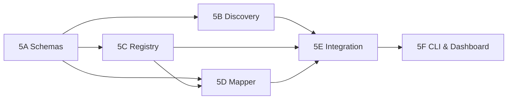

# Phase 5 — Unified Actuator Surface

**Target:** CoreMind v2
**Duration estimate:** 1 week
**Agent:** Opus in VS Code
**Depends on:** Phase 1 (Autonomy Slider), Phase 4 (Auto-Investigation)

---

## Subphases

| Subphase | File | Effort | Prerequisites |
|---|---|---|---|
| 5A | [Schemas & Package Scaffold](PHASE_5A_SCHEMAS.md) | 1–2h | None |
| 5B | [Discovery Engine](PHASE_5B_DISCOVERY_ENGINE.md) | 3–4h | 5A |
| 5C | [Capability Registry](PHASE_5C_CAPABILITY_REGISTRY.md) | 2–3h | 5A |
| 5D | [Action Mapper](PHASE_5D_ACTION_MAPPER.md) | 2–3h | 5A, 5C |
| 5E | [Unified Actuator & Integration](PHASE_5E_UNIFIED_ACTUATOR_INTEGRATION.md) | 3–4h | 5B, 5C, 5D |
| 5F | [CLI & Dashboard](PHASE_5F_CLI_DASHBOARD.md) | 2–3h | 5E |

### Parallelism



**Parallel lanes after 5A:**
- **Lane 1:** 5B (Discovery Engine) — independent, only needs schemas.
- **Lane 2:** 5C (Registry) → 5D (Mapper) — sequential, mapper depends on registry.

5B and 5C can run simultaneously in two agent sessions.

---

## 1. Problem Statement

**Current state:** Every device/service has its own plugin with its own API, operation names, and parameter schemas. CoreMind must know:
- `coremind.plugin.homeassistant.light.turn_on` with `{"entity_id": "light.bureau"}`
- `coremind.plugin.homeassistant.vacuum.send_command` with `{"command": "app_segment_clean", "params": [[20], 1]}`

This is brittle. Adding a new device means writing a new plugin. The LLM must memorize exact operation names and parameter formats. When Andrej Karpathy describes OpenClaw scanning his network and finding his Sonos speakers and lights automatically — merging 6 apps into one — that's the vision.

**Goal:** A unified actuator surface where CoreMind says "turn off all lights" and the system figures out which devices, which protocols, and which parameters.

---

## 2. Design

### 2.1 Architecture Overview

```
┌────────────────────────────────────────────────────────────┐
│                    UNIFIED ACTUATOR                         │
│                                                             │
│  ┌─────────────┐  ┌──────────────┐  ┌──────────────────┐  │
│  │  Discovery   │  │  Capability  │  │  Action Mapper   │  │
│  │  Engine (L0) │─▶│  Registry    │─▶│  (goal→commands) │  │
│  └─────────────┘  └──────────────┘  └────────┬─────────┘  │
│                                                │            │
│  ┌─────────────────────────────────────────────▼─────────┐ │
│  │              Plugin Abstraction Layer                  │ │
│  │  ┌──────┐ ┌──────┐ ┌──────┐ ┌──────┐ ┌──────┐        │ │
│  │  │  HA  │ │ Hue  │ │Sonos │ │Tapo  │ │Govee │  ...   │ │
│  │  └──────┘ └──────┘ └──────┘ └──────┘ └──────┘        │ │
│  └───────────────────────────────────────────────────────┘ │
└────────────────────────────────────────────────────────────┘
```

### 2.2 Discovery Engine (L0)

#### 2.2.1 Protocol Discovery

The discovery engine probes the local network for controllable devices:

```python
class DiscoveryMethod(enum.Enum):
    MDNS = "mdns"           # _hap._tcp, _sonos._tcp, _hue._tcp
    HOME_ASSISTANT = "ha"   # api/states scan
    PLUGIN_MANIFEST = "plugin"  # gRPC Identify()
    UPNP = "upnp"           # SSDP discovery
    STATIC_CONFIG = "static"  # manually configured
```

#### 2.2.2 Discovery Cycle

```python
class DiscoveryEngine:
    """Runs on daemon startup and periodically (every 6h by default)."""

    def __init__(
        self,
        ha_client: HomeAssistantClient | None = None,
        mdns_scanner: MDNSScanner | None = None,
        plugin_registry: PluginRegistry | None = None,
    ) -> None:
        self._methods: list[DiscoveryMethod] = []
        if ha_client:
            self._methods.append(DiscoveryMethod.HOME_ASSISTANT)
        if mdns_scanner:
            self._methods.append(DiscoveryMethod.MDNS)
        if plugin_registry:
            self._methods.append(DiscoveryMethod.PLUGIN_MANIFEST)

    async def discover(self) -> list[DiscoveredDevice]:
        """Run all discovery methods, deduplicate, return devices."""
        all_devices: list[DiscoveredDevice] = []
        for method in self._methods:
            try:
                devices = await self._run_discovery(method)
                all_devices.extend(devices)
            except DiscoveryError:
                log.warning("discovery.method_failed", method=method.value)
        return self._deduplicate(all_devices)
```

#### 2.2.3 HA API Scan

```python
async def _discover_via_ha(self) -> list[DiscoveredDevice]:
    """Scan Home Assistant for all controllable entities."""
    states = await self._ha_client.get_states()
    devices = []
    for entity in states:
        entity_id = entity["entity_id"]
        domain = entity_id.split(".")[0]

        # Map HA domains to capability types
        capability = HA_DOMAIN_CAPABILITY_MAP.get(domain)
        if capability is None:
            continue

        device = DiscoveredDevice(
            id=f"ha:{entity_id}",
            name=entity.get("attributes", {}).get("friendly_name", entity_id),
            type=capability.device_type,
            capabilities=capability.actions,
            source=DiscoveryMethod.HOME_ASSISTANT,
            raw_metadata={"entity_id": entity_id, "domain": domain},
            discovered_at=datetime.now(UTC),
        )
        devices.append(device)
    return devices

# Mapping HA domains to capability types
HA_DOMAIN_CAPABILITY_MAP = {
    "light": CapabilityInfo(DeviceType.LIGHT, [ActionType.TURN_ON, ActionType.TURN_OFF, ActionType.SET_BRIGHTNESS, ActionType.SET_COLOR]),
    "switch": CapabilityInfo(DeviceType.SWITCH, [ActionType.TURN_ON, ActionType.TURN_OFF]),
    "climate": CapabilityInfo(DeviceType.THERMOSTAT, [ActionType.SET_TEMPERATURE, ActionType.TURN_ON, ActionType.TURN_OFF]),
    "vacuum": CapabilityInfo(DeviceType.VACUUM, [ActionType.START_CLEANING, ActionType.STOP_CLEANING, ActionType.RETURN_TO_BASE]),
    "lock": CapabilityInfo(DeviceType.LOCK, [ActionType.LOCK, ActionType.UNLOCK]),
    "media_player": CapabilityInfo(DeviceType.MEDIA, [ActionType.PLAY, ActionType.PAUSE, ActionType.SET_VOLUME]),
    "cover": CapabilityInfo(DeviceType.COVER, [ActionType.OPEN, ActionType.CLOSE]),
    "camera": CapabilityInfo(DeviceType.CAMERA, [ActionType.SNAPSHOT]),
    "sensor": CapabilityInfo(DeviceType.SENSOR, [ActionType.READ_VALUE]),
    "humidifier": CapabilityInfo(DeviceType.HUMIDIFIER, [ActionType.TURN_ON, ActionType.TURN_OFF, ActionType.SET_HUMIDITY]),
}
```

#### 2.2.4 mDNS Discovery

```python
class MDNSScanner:
    """Scans local network for smart home devices via mDNS."""

    SERVICE_TYPES = [
        "_hap._tcp.local.",       # HomeKit (Hue, etc.)
        "_sonos._tcp.local.",     # Sonos
        "_googlecast._tcp.local.", # Chromecast
        "_spotify-connect._tcp.local.",
    ]

    async def scan(self, timeout: float = 10.0) -> list[DiscoveredDevice]:
        """Scan mDNS for known service types."""
        devices = []
        for service_type in self.SERVICE_TYPES:
            try:
                results = await self._query_mdns(service_type, timeout)
                for result in results:
                    device = self._parse_mdns_result(service_type, result)
                    if device:
                        devices.append(device)
            except Exception:
                log.debug("mdns.scan_failed", service=service_type)
        return devices
```

### 2.3 Capability Registry

#### 2.3.1 Data Model

```python
class ActionType(str, enum.Enum):
    """Standardized action types across all device protocols."""
    TURN_ON = "turn_on"
    TURN_OFF = "turn_off"
    SET_BRIGHTNESS = "set_brightness"
    SET_COLOR = "set_color"
    SET_TEMPERATURE = "set_temperature"
    SET_HUMIDITY = "set_humidity"
    SET_VOLUME = "set_volume"
    PLAY = "play"
    PAUSE = "pause"
    START_CLEANING = "start_cleaning"
    STOP_CLEANING = "stop_cleaning"
    RETURN_TO_BASE = "return_to_base"
    LOCK = "lock"
    UNLOCK = "unlock"
    OPEN = "open"
    CLOSE = "close"
    SNAPSHOT = "snapshot"
    READ_VALUE = "read_value"
    SEND_NOTIFICATION = "send_notification"
    EXECUTE_COMMAND = "execute_command"

class DeviceType(str, enum.Enum):
    LIGHT = "light"
    SWITCH = "switch"
    THERMOSTAT = "thermostat"
    VACUUM = "vacuum"
    LOCK = "lock"
    MEDIA = "media"
    COVER = "cover"
    CAMERA = "camera"
    SENSOR = "sensor"
    HUMIDIFIER = "humidifier"
    SPEAKER = "speaker"
    UNKNOWN = "unknown"

class Capability(BaseModel):
    """A single thing a device can do, with its protocol-specific mapping."""
    action: ActionType
    # How to execute this action on this specific device/protocol
    protocol: str  # "homeassistant", "hue", "sonos", "tapo"
    operation: str  # protocol-specific operation name
    parameter_mapping: dict[str, str] = Field(default_factory=dict)
    # e.g. {"brightness": "brightness_pct"} for HA lights

class DeviceCapabilities(BaseModel):
    """All capabilities of a discovered device."""
    device_id: str
    device_name: str
    device_type: DeviceType
    room: str | None = None
    capabilities: list[Capability]
    source_plugin: str
    last_seen: datetime
    metadata: dict[str, Any] = Field(default_factory=dict)

class CapabilityRegistry:
    """In-memory + persisted registry of all known device capabilities."""

    def __init__(self, store_path: Path) -> None:
        self._path = store_path
        self._devices: dict[str, DeviceCapabilities] = {}
        self._by_type: dict[DeviceType, list[str]] = defaultdict(list)
        self._by_action: dict[ActionType, list[str]] = defaultdict(list)

    def register(self, device: DeviceCapabilities) -> None:
        self._devices[device.device_id] = device
        self._by_type[device.device_type].append(device.device_id)
        for cap in device.capabilities:
            self._by_action[cap.action].append(device.device_id)

    def find_by_action(self, action: ActionType, room: str | None = None) -> list[DeviceCapabilities]:
        """Find all devices that can perform a given action, optionally filtered by room."""
        device_ids = self._by_action.get(action, [])
        devices = [self._devices[did] for did in device_ids]
        if room:
            devices = [d for d in devices if d.room == room]
        return devices

    def find_by_type(self, device_type: DeviceType) -> list[DeviceCapabilities]:
        return [self._devices[did] for did in self._by_type.get(device_type, [])]
```

### 2.4 Action Mapper

The Action Mapper translates natural-language or structured goals into protocol-specific commands.

```python
class ActionMapper:
    """Maps high-level goals to protocol-specific operations."""

    def __init__(self, registry: CapabilityRegistry) -> None:
        self._registry = registry

    def resolve(
        self,
        goal: str,                     # e.g., "turn off all lights in the living room"
        action_type: ActionType | None = None,
        room: str | None = None,
        device_type: DeviceType | None = None,
        parameters: dict[str, Any] | None = None,
    ) -> list[ResolvedAction]:
        """Resolve a goal into concrete actions."""
        # If action_type is specified, filter by it
        if action_type:
            candidates = self._registry.find_by_action(action_type, room=room)
        elif device_type:
            candidates = self._registry.find_by_type(device_type)
        else:
            # Use LLM to disambiguate (lightweight call)
            candidates = self._llm_resolve(goal, room)

        actions = []
        for device in candidates:
            for cap in device.capabilities:
                if action_type and cap.action != action_type:
                    continue
                action = ResolvedAction(
                    device_id=device.device_id,
                    device_name=device.device_name,
                    action=cap.action,
                    protocol=cap.protocol,
                    operation=cap.operation,
                    parameters=self._map_parameters(parameters or {}, cap.parameter_mapping),
                )
                actions.append(action)
        return actions

    def _llm_resolve(self, goal: str, room: str | None = None) -> list[DeviceCapabilities]:
        """Use a lightweight LLM call to resolve ambiguous goals to devices.

        This is a SMALL call (~500 tokens) — just for disambiguation, not reasoning.
        """
        devices_summary = self._registry.to_compact_summary(room=room)
        prompt = (
            f"Given the user's goal: '{goal}'\n"
            f"And these available devices:\n{devices_summary}\n\n"
            "Return JSON: {'device_ids': [...]} listing which devices should be targeted."
        )
        response = self._llm.complete(prompt, max_tokens=200)
        device_ids = json.loads(response)["device_ids"]
        return [self._registry._devices[did] for did in device_ids if did in self._registry._devices]

class ResolvedAction(BaseModel):
    """A concrete action ready for execution."""
    device_id: str
    device_name: str
    action: ActionType
    protocol: str
    operation: str
    parameters: dict[str, Any] = Field(default_factory=dict)
```

### 2.5 Unified Act API

```python
class UnifiedActuator:
    """Single entry point for all actions in CoreMind."""

    def __init__(
        self,
        discovery: DiscoveryEngine,
        registry: CapabilityRegistry,
        mapper: ActionMapper,
        executor: Executor,  # existing L6 executor
    ) -> None:
        self._discovery = discovery
        self._registry = registry
        self._mapper = mapper
        self._executor = executor

    async def refresh_devices(self) -> None:
        """Re-discover all devices."""
        devices = await self._discovery.discover()
        for device in devices:
            capabilities = self._device_to_capabilities(device)
            self._registry.register(capabilities)
        await self._registry.persist()

    async def act(
        self,
        goal: str,
        *,
        action_type: ActionType | None = None,
        room: str | None = None,
        device_type: DeviceType | None = None,
        parameters: dict[str, Any] | None = None,
        confidence: float = 0.0,
    ) -> list[ActionResult]:
        """Execute a high-level goal.

        Args:
            goal: Natural language description of what to do.
            action_type: Optional specific action type.
            room: Optional room filter.
            device_type: Optional device type filter.
            parameters: Optional action parameters.
            confidence: System confidence in this action (for autonomy slider).

        Returns:
            One ActionResult per device targeted.
        """
        resolved = self._mapper.resolve(
            goal, action_type=action_type, room=room,
            device_type=device_type, parameters=parameters,
        )

        results = []
        for action in resolved:
            # Delegate to existing L6 executor
            result = await self._executor.execute_resolved(action, confidence)
            results.append(result)
        return results

    def list_devices(self, room: str | None = None) -> list[DeviceCapabilities]:
        """List all known devices, optionally filtered by room."""
        devices = list(self._registry._devices.values())
        if room:
            devices = [d for d in devices if d.room == room]
        return sorted(devices, key=lambda d: d.device_name)
```

---

## 3. Files to Create/Modify

### New Files
| File | Purpose |
|---|---|
| `src/coremind/actuator/__init__.py` | Package init |
| `src/coremind/actuator/discovery.py` | DiscoveryEngine + mDNS + HA scanner |
| `src/coremind/actuator/registry.py` | CapabilityRegistry |
| `src/coremind/actuator/mapper.py` | ActionMapper |
| `src/coremind/actuator/unified.py` | UnifiedActuator |
| `src/coremind/actuator/schemas.py` | All Pydantic models |

### Modified Files
| File | Change |
|---|---|
| `src/coremind/core/daemon.py` | Initialize UnifiedActuator on startup, run discovery |
| `src/coremind/core/config.py` | Add ActuatorConfig (discovery interval, mDNS timeout) |
| `src/coremind/action/executor.py` | Add `execute_resolved()` method for ResolvedAction |
| `src/coremind/intention/loop.py` | Use unified act() API instead of plugin-specific operations |
| `src/coremind/dashboard/views.py` | Add device list, discovery status page |
| `pyproject.toml` | Add zeroconf dependency for mDNS |
| `~/.coremind/config.toml` | Add [actuator] section |

---

## 4. Configuration Schema

```toml
[actuator]
# Discovery
discovery_enabled = true
discovery_interval_seconds = 21600  # every 6 hours
mdns_timeout_seconds = 10.0

# Home Assistant source
ha_discovery_enabled = true
# HA credentials read from secrets

# Plugin manifest source
plugin_manifest_discovery_enabled = true

# mDNS source
mdns_discovery_enabled = true
mdns_service_types = [
    "_hap._tcp.local.",
    "_sonos._tcp.local.",
    "_googlecast._tcp.local.",
]

# LLM for goal disambiguation (lightweight, infrequent)
disambiguation_model = "ollama/deepseek-v4-flash:cloud"
disambiguation_max_tokens = 200

# Capability registry storage
registry_path = "~/.coremind/capability_registry.json"
```

---

## 5. CLI Commands

```bash
# Discovery
coremind actuator discover           # Force re-discovery now
coremind actuator discover --status  # Last discovery results

# Device listing
coremind actuator list                        # All devices
coremind actuator list --room "living room"   # Filter by room
coremind actuator list --type light           # Filter by type

# Action execution (testing)
coremind actuator act "turn off all lights"
coremind actuator act "set living room temperature to 21" --confidence 0.9

# Registry management
coremind actuator registry export > backup.json
coremind actuator registry stats   # Count by type, protocol, etc.
```

---

## 6. Dashboard Additions

### 6.1 Device Inventory Page (`/devices`)
- Table: Name, Type, Room, Protocol, Capabilities, Last Seen
- Filter by type, room
- Discovery status badge (last scan time, device count)

### 6.2 Cockpit Integration
- Add "Devices" stat card showing total device count
- Quick-action buttons for common operations

---

## 7. Migration Path

1. **Phase 1: Register existing plugins.** Run discovery against HA + plugin manifests. Existing plugins continue working unchanged.
2. **Phase 2: Add unified act().** The intention loop starts using `unified.act()` for new intents. Old intents still use plugin-specific operations.
3. **Phase 3: Phase out direct plugin calls.** As confidence grows, all actions route through the unified surface. Direct plugin calls become the fallback.

No breaking changes. The unified surface is additive.

---

## 8. Tests

### 8.1 Unit Tests
```python
# test_discovery.py
async def test_ha_discovery_parses_lights():
    """HA light entities map to DeviceType.LIGHT with TURN_ON capability."""

async def test_mdns_parses_sonos():
    """_sonos._tcp service maps to DeviceType.SPEAKER."""

async def test_deduplication_same_device_two_sources():
    """Same device discovered via HA and mDNS → single registry entry."""

# test_registry.py
def test_find_by_action_returns_correct_devices():
    """find_by_action(TURN_OFF) returns only devices with that capability."""

def test_room_filtering():
    """find_by_action(TURN_ON, room='bedroom') returns only bedroom devices."""

# test_mapper.py
def test_resolve_simple_goal():
    """'turn off living room lights' → resolves to all living room light devices."""

def test_resolve_with_explicit_action():
    """action_type=TURN_OFF, device_type=LIGHT → all lights."""

# test_unified.py
async def test_act_delegates_to_executor():
    """unified.act('turn off lights') → executor.execute_resolved called for each device."""
```

### 8.2 Integration Tests
```python
async def test_full_discovery_cycle():
    """Run discovery, register devices, verify registry is populated."""

async def test_act_after_discovery():
    """Discover → act → verify correct executor calls."""

async def test_fallback_when_no_devices_match():
    """Goal with no matching devices → returns empty list, logs warning."""
```

---

## 9. Success Metrics

| Metric | Target |
|---|---|
| Devices auto-discovered | >90% of existing home devices |
| Time to first discovery | <30 seconds |
| Actuator act() latency | <500ms for simple goals |
| Registry query latency | <10ms |
| False positive device detection | 0 (every device in registry must work) |

---

## 10. Dependencies

- `zeroconf` (Python package for mDNS)
- Existing: `grpcio`, `structlog`, `pydantic`, `httpx` (for HA API)

---

**Next step:** Proceed to implementation.
